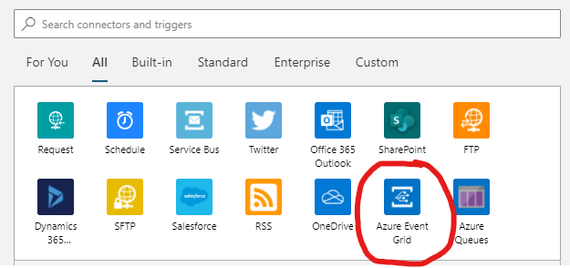
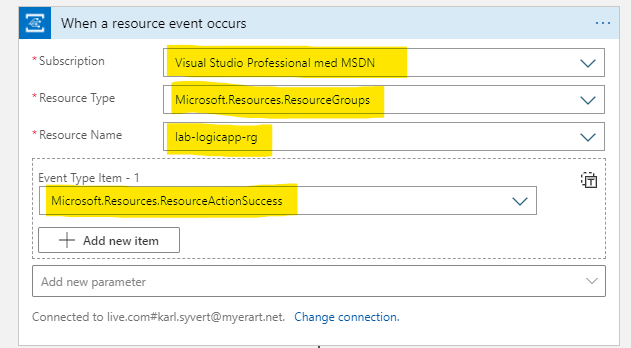
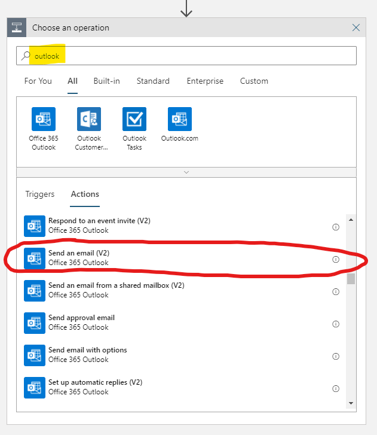
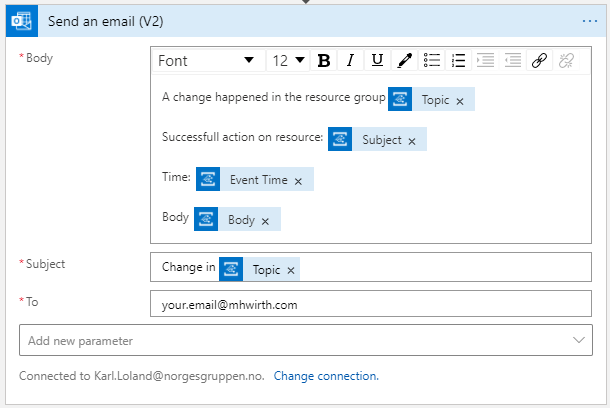
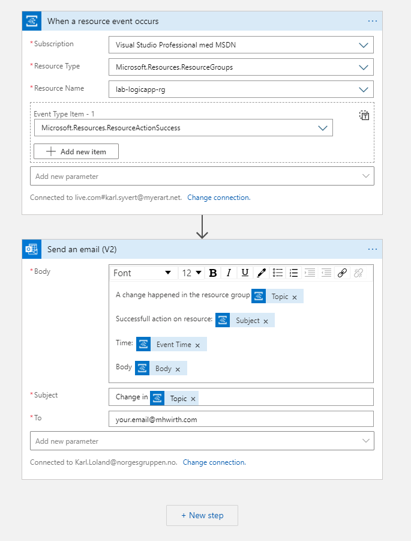

# Lab 5 - Azure Logic Apps

The goal of this lab is to show how easy it is to create workflows and integrations using Azure Logic Apps.

## Part 1 - Azure Logic App using Azure Portal

1. Log in to Azure Portal at portal.azure.com
2. Create a new resource group located in North Europe called `lab-logicapp-rg`
3. Navigate in to the newly created resource group and press the `Add` button.
4. Find a resource named "Logic App". 
5. Press `Create`
   1. Choose the resource group `lab-logicapp-rg` if not already selected.
   2. Give the app a unique name of your choosing
   3. Select `North Europe` as region
   4. Rest of the settings can be left to default
   5. Press `Review + create`
   6. Press `Create`
6. Navigate to the newly created Azure Logic App resource and select the `Logic App designer` option in the left side menu under the `Development Tools` category

## Part 2 - Create a Azure Logic App using the Logic App Designer

1. Start with a `Blank Logic App`
2. Select the `Azure Event Grid` trigger

3. Set up the Event grid trigger with your own subscription and resource group and use the event type: `Microsoft.Resources.ResourceActionSuccess`

4. Press `+ New step` button and search after `outlook` action. Select the `Send an email (V2)` action.

5. Set up the send email action by setting the following values. (Replace your.email@mhworth.com with your own.)

6. Verify that the Logic App looks somewhat like the image under and press `Save`

7. You can no press `Run` to start your logic app.
8. Create a resource in the `lab-logicapp-rg` resource group and watch as emails start coming in regarding successful actions in the resource group.

BONUS:

If you have enough time left. You can follow the [Travel Time to Work](https://docs.microsoft.com/en-us/azure/logic-apps/tutorial-build-schedule-recurring-logic-app-workflow) tutorial from Microsoft. (Remember to get a Bing maps API key)

## Links
- https://docs.microsoft.com/en-us/azure/logic-apps/
- https://docs.microsoft.com/en-us/azure/logic-apps/quickstart-create-first-logic-app-workflow
- https://docs.microsoft.com/en-us/azure/event-grid/event-schema-resource-groups
- https://docs.microsoft.com/en-us/azure/logic-apps/tutorial-build-schedule-recurring-logic-app-workflow
